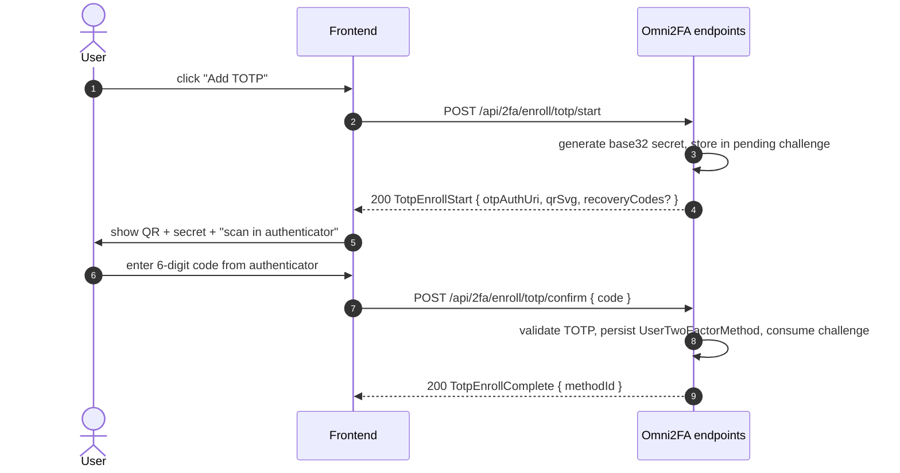
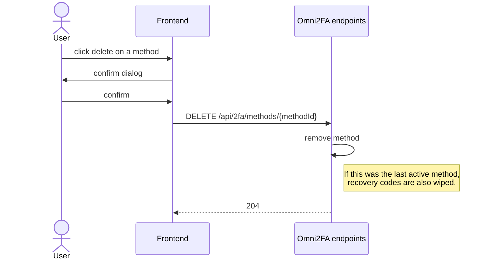

# Omni2FA — Flows

This document describes the user-facing flows Omni2FA orchestrates. The OpenAPI spec in `Core/protocol/` is the machine-readable counterpart — keep both in sync.

## Glossary

- **Pre-auth token** — short-lived (~3-5 min) JWT issued after password verification but before 2FA verification. Carries `userId` + `purpose=2fa-pending`. The frontend includes it in every step of the 2FA ceremony so the server knows whose flow this is without leaking identity to the URL/storage.
- **Challenge** — server-side state for a 2FA ceremony in progress. Stored in `Omni2FaChallenges` table: hashed OTP for email, challenge bytes for WebAuthn, expiry, consumed flag. Consumed on first successful verification.
- **Method** — an enrolled 2FA factor on a user. Rows in `Omni2FaMethods`: kind (Totp / Email / WebAuthn), method-specific fields, optional human-readable name.
- **Recovery code** — single-use code that substitutes for any 2FA method during login. Generated on first method enrollment, hashed at rest, shown to the user **once**.

---

## 1. Login

```mermaid
sequenceDiagram
    autonumber
    actor U as User
    participant FE as Frontend
    participant BE as Host Backend
    participant O as Omni2FA endpoints

    U->>FE: enter email + password
    FE->>BE: POST /auth/login
    BE->>BE: verify password (host responsibility)

    alt user has no 2FA methods
        BE->>FE: 200 LoginResponse (final session JWT)
    else user has 2FA methods
        BE->>O: issue pre-auth token (userId, 3-5 min TTL)
        O->>FE: 200 PreAuthChallenge { preAuthToken, availableMethods[] }
        FE->>U: render method picker

        U->>FE: pick method
        FE->>O: POST /api/2fa/challenge/start { preAuthToken, methodId }
        note right of O: Email — send OTP; WebAuthn — return assertion request; TOTP — noop
        O-->>FE: 200 ChallengeStartResponse (kind-specific payload)

        U->>FE: enter code / produce assertion
        FE->>O: POST /api/2fa/challenge/verify { preAuthToken, methodId, code|assertion }
        O->>O: validate, consume challenge, mark method.lastUsedAt
        O-->>BE: signal "user X verified"
        BE->>FE: 200 LoginResponse (final session JWT)
    end
```

### Error paths

- Pre-auth token expired → `401 PREAUTH_EXPIRED` → frontend sends user back to password step.
- Wrong code → `401 INVALID_CODE`. Rate limiter (default 20 attempts / minute / IP, see `docs/CODE_STYLE.md`) governs lockout — after threshold: `429 TOO_MANY_ATTEMPTS`.
- Challenge already consumed → `409 CHALLENGE_CONSUMED`.

### Recovery-code substitution

At any point on the verify step the user can click "use recovery code". Frontend calls a different endpoint:

```
POST /api/2fa/challenge/recovery-code { preAuthToken, recoveryCode }
```

On success the recovery code is marked used (one-time) and the user gets a final session JWT.

---

## 2. Enrollment (TOTP example)



**Email enrollment** is the same shape — `enroll/email/start` (issues + sends OTP) and `enroll/email/confirm` (validates).

**WebAuthn enrollment** has a different shape because the ceremony is browser-led:
1. `start` returns a `PublicKeyCredentialCreationOptions` JSON (challenge + relying-party info).
2. Browser performs the ceremony via `navigator.credentials.create()`.
3. `confirm` posts the attestation; server validates with Fido2NetLib and persists.

### Recovery codes — generated on first method enrollment

When a user enrolls their **first** 2FA method (regardless of kind), the server also generates N recovery codes (default 10), hashes them, persists hashes, and returns the plaintext codes **in the enrollment response, exactly once**. The frontend MUST show them and instruct the user to save them — no second chance.

Regeneration (`POST /api/2fa/recovery-codes/regenerate`) invalidates all previous codes.

---

## 3. Method removal



Whether deleting the last method is allowed is a **host-app policy**. Omni2FA exposes an `Allow2FaDisabling` configuration flag (default: `true`). When `false`, attempts to remove the last method return `409 LAST_METHOD_PROTECTED`. Apps that require 2FA for specific roles enforce this server-side at the endpoint that calls Omni2FA, not inside Omni2FA itself.

---

## 4. Trusted devices (planned v1.1, not in v0.x)

Design boundary today: the pre-auth flow above must not preclude adding a "trusted device cookie" later. Sketch:

1. After a successful verify, frontend asks "trust this device for 30 days?".
2. If yes, server issues a signed device cookie bound to user-agent fingerprint + user id.
3. Next login from the same browser: if cookie valid → skip 2FA, issue session directly.
4. Stored server-side as `Omni2FaTrustedDevice` row (revocable from user's profile).

This is a **post-v1.0** feature. Documented here only to confirm the current model doesn't paint us into a corner.

---

## 5. Audit events (host-pluggable)

Each significant action raises an audit event through `IOmni2FaAuditSink`:

- `MethodEnrolled`
- `MethodRemoved`
- `LoginVerifySucceeded`
- `LoginVerifyFailed`
- `RecoveryCodesGenerated`
- `RecoveryCodeUsed`
- `RecoveryCodesRegenerated`
- `RateLimitExceeded`

Default implementation writes structured `ILogger` records. Host applications can implement the interface to forward into their own audit log (database, SIEM, message queue). The interface is **opt-in** — if the host doesn't register one, only `ILogger` output happens, no `null` ref errors.

---

## 6. What lives where

| Concern | Host application | Omni2FA |
|---------|------------------|---------|
| Verify password | ✅ | — |
| Issue final session JWT | ✅ | — |
| Issue pre-auth token | — | ✅ |
| Store `User` table | ✅ | — |
| Store `Omni2FaMethods`, `Omni2FaChallenges`, `Omni2FaRecoveryCodes` | ✅ (your DbContext, via `ApplyOmni2FaConfiguration()`) | — (schema + adapter) |
| Generate / validate TOTP, OTP, WebAuthn | — | ✅ |
| Send 2FA emails | — | ✅ (SMTP via MailKit, overridable) |
| Render profile / settings page | ✅ | — |
| Render 2FA section, enrollment dialogs | optional | ✅ (`@omni2fa/react-mui`) |
| Reset 2FA for a user (admin override) | ✅ (your policy) | ✅ (we expose the primitive) |
| Account recovery when 2FA is lost | ✅ | — (out of scope) |
