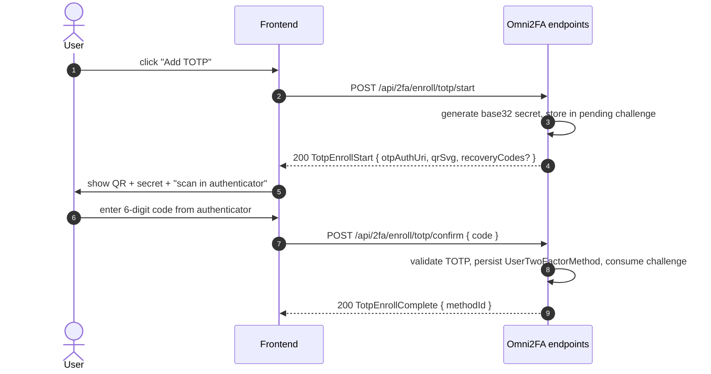
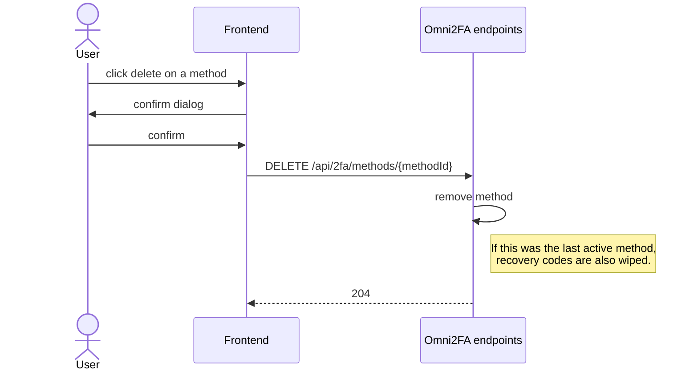
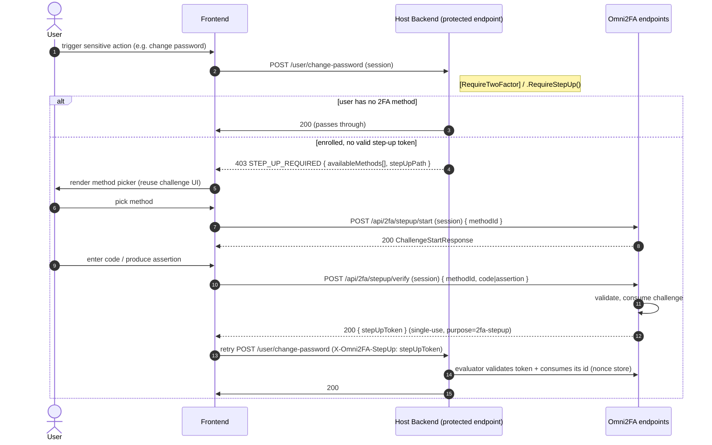

# Omni2FA — Flows

This document describes the user-facing flows Omni2FA orchestrates. The OpenAPI spec in `Core/protocol/` is the machine-readable counterpart — keep both in sync.

## Glossary

- **Pre-auth token** — short-lived (~3-5 min) JWT issued after password verification but before 2FA verification. Carries `userId` + `purpose=2fa-pending`. The frontend includes it in every step of the 2FA ceremony so the server knows whose flow this is without leaking identity to the URL/storage.
- **Verified-handoff token** — short-lived (~2 min) JWT returned by `challenge/verify` and `challenge/recovery-code` on success. Carries `userId` + `purpose=2fa-verified`. The frontend forwards it to the host's finalize endpoint, which validates it (`ValidateVerified`) to mint the session. This is the proof 2FA actually passed — the host never infers success from audit events or trusts the client. Same token for code, passkey, and recovery-code.
- **Step-up token** — short-lived (default 5 min) **single-use** JWT returned by `stepup/verify`. Carries `userId` + `purpose=2fa-stepup`. The frontend attaches it in the `X-Omni2FA-StepUp` header when retrying a step-up-protected action; the gate validates it, checks the subject matches the caller, and consumes its id so it can't be reused — unless the host opened a grace window (`StepUp.GraceWindow`, off by default), during which the same token answers for further actions.
- **Challenge** — server-side state for a 2FA ceremony in progress. Stored in `Omni2FaChallenges` table: hashed OTP for email, challenge bytes for WebAuthn, expiry, consumed flag. Consumed on first successful verification.
- **Method** — an enrolled 2FA factor on a user. Rows in `Omni2FaMethods`: type (Totp / Email / WebAuthn), method-specific fields, optional human-readable name.
- **Recovery code** — single-use code that substitutes for any 2FA method during login. Generated on first method enrollment, hashed at rest, shown to the user **once**.

---

## 1. Login

```mermaid
sequenceDiagram
    autonumber
    actor U as User
    participant FE as Frontend
    participant BE as Host Backend
    participant O as Omni2FA endpoints

    U->>FE: enter email + password
    FE->>BE: POST /auth/login
    BE->>BE: verify password (host responsibility)

    alt user has no 2FA methods
        BE->>FE: 200 LoginResponse (final session JWT)
    else user has 2FA methods
        BE->>O: issue pre-auth token (userId, 3-5 min TTL)
        O->>FE: 200 PreAuthChallenge { preAuthToken, availableMethods[] }
        FE->>U: render method picker

        U->>FE: pick method
        FE->>O: POST /api/2fa/challenge/start { preAuthToken, methodId }
        note right of O: Email — send OTP; WebAuthn — return assertion request; TOTP — noop
        O-->>FE: 200 ChallengeStartResponse (type-specific payload)

        U->>FE: enter code / produce assertion
        FE->>O: POST /api/2fa/challenge/verify { preAuthToken, methodId, code|assertion }
        O->>O: validate, consume challenge, mark method.lastUsedAt
        O-->>FE: 200 VerifySuccessResponse { verifiedToken }
        FE->>BE: POST /auth/finalize (Bearer verifiedToken)
        BE->>BE: ValidateVerified(verifiedToken) → userId
        BE->>FE: 200 LoginResponse (final session JWT)
    end
```

### Reload in the middle of the ceremony

The user leaves for the mail app to read the code, and comes back to a page the browser has thrown
away — routine on a memory-constrained iPhone, and reproducible anywhere with F5. Both halves of the
ceremony survive it: the pre-auth token because `storage` defaults to `sessionStorage`, and the
challenge because the core writes `{ methodId, methodType, expiresAt, resendAvailableAt }` alongside
it while the machine waits for the code. `createOmni2Fa` reads the pair back and sends `resume`, which
enters `awaitingCode` **without calling `/challenge/start`** — starting again would send a second code
and invalidate the one already in the user's clipboard.

The restore is skipped when there is no pre-auth token (nothing could be verified), and the snapshot is
dropped once the challenge is `verified`, reset to `idle`, or `failed`. A host that renders its 2FA
screen from `useChallenge().status` needs no code for any of this; one that renders from its own
`useState` will still show the login form, because that flag is not what the core restored.

### Error paths

- Pre-auth token expired → `401 PREAUTH_EXPIRED` → frontend sends user back to password step.
- Wrong code → `401 INVALID_CODE`. Rate limiter (default 20 attempts / minute / IP, see `docs/CODE_STYLE.md`) governs lockout — after threshold: `429 TOO_MANY_ATTEMPTS`.
- Challenge already consumed → `409 CHALLENGE_CONSUMED`.

### Recovery-code substitution

At any point on the verify step the user can click "use recovery code". Frontend calls a different endpoint:

```
POST /api/2fa/challenge/recovery-code { preAuthToken, recoveryCode }
```

On success the recovery code is marked used (one-time) and the response carries the same `verifiedToken` as a normal verify — so the host's finalize path is identical, recovery or not.

---

## 2. Enrollment (TOTP example)



**Email enrollment** is the same shape — `enroll/email/start` (issues + sends OTP) and `enroll/email/confirm` (validates).

**WebAuthn enrollment** has a different shape because the ceremony is browser-led:
1. `start` returns a `PublicKeyCredentialCreationOptions` JSON (challenge + relying-party info).
2. Browser performs the ceremony via `navigator.credentials.create()`.
3. `confirm` posts the attestation; server validates with Fido2NetLib and persists.

> ⚠️ **WebAuthn requires HTTPS on any non-localhost origin.** See "Common deployment gotchas" at the bottom of this document.

### Recovery codes — generated on first method enrollment

When a user enrolls their **first** 2FA method (regardless of kind), the server also generates N recovery codes (default 10), hashes them, persists hashes, and returns the plaintext codes **in the enrollment response, exactly once**. The frontend MUST show them and instruct the user to save them — no second chance.

Regeneration (`POST /api/2fa/recovery-codes/regenerate`) invalidates all previous codes.

---

## 3. Method removal



Whether deleting the last method is allowed is a **host-app policy**. Omni2FA exposes an `Allow2FaDisabling` configuration flag (default: `true`). When `false`, attempts to remove the last method return `409 LAST_METHOD_PROTECTED`. Apps that require 2FA for specific roles enforce this server-side at the endpoint that calls Omni2FA, not inside Omni2FA itself.

---

## 4. Step-up (action confirmation)

Re-confirm 2FA right before a sensitive action, independent of login. The host decorates its own endpoint; Omni2FA only answers "is a fresh 2FA proven?" and, when not, tells the frontend how to get one.



The `useStepUp` hook's `confirmTwoFactor(methods)` runs the prompt and resolves the single-use token; you attach it in the `X-Omni2FA-StepUp` header on your request (in your own fetch/axios layer — the library stays transport-agnostic, so cookie and Bearer sessions both work). Two ways to use it:

- **Reactive** (diagram above) — react to the server's `403 STEP_UP_REQUIRED`, ideally in one central interceptor (next to your `401` handling), so every protected endpoint is covered at once. Methods come from `details.availableMethods`.
- **Proactive** — when you already know an action needs 2FA, confirm up-front (methods from `useMethods()` / `listMethods`) and send the request already carrying the header, skipping the 403 round-trip. You decide whether to prompt (`methods.length > 0`); if the user has no 2FA, just send — the server passes it through.

For Omni2FA's **own** destructive endpoints (remove method, regenerate recovery codes, enroll a new factor — opt-in via `StepUp.RequireTwoFactorTo*`), the client handles the same 403 → confirm → retry loop itself: a mounted `useStepUp()` registers its `confirmTwoFactor` on the client (React does it for you; other adapters call `omni.client.setStepUpHandler(confirmTwoFactor)`), and the hooks and direct client calls then prompt and retry transparently.

### Notes

- **Single-use.** Each step-up token satisfies exactly one protected call (the spent id is recorded until expiry), so every sensitive action triggers its own fresh confirmation.
- **Grace window (opt-in, off by default).** `StepUp.GraceWindow` keeps a passed 2FA challenge usable for further actions — either ceremony counts, so the first protected page after signing in does not ask again either. After the window the token falls back to its single use. A recovery-code login never grants one. The window is carried in the token, so only the browser that confirmed benefits — another session of the same user still confirms. The server returns it (`graceUntil` / `stepUpGraceUntil`) and the client caches the token in memory, attaching it up front and dropping it on any `403 STEP_UP_REQUIRED`; with `useStepUp`, `confirmTwoFactor` resolves from that cache without showing the prompt.
- **Identity-bound.** The gate rejects a token whose subject ≠ the authenticated caller — a stolen token can't be replayed against another account.
- **Multi-instance.** The default consumed-id store is in-memory; across nodes a token spent on one isn't seen by the others (replay window ≤ token TTL). Register a shared `IStepUpNonceStore` to close it.
- **No bypass for enrolled users** — the only pass-through is "no method enrolled".

---

## 5. Trusted devices (planned v1.3, not in v0.x)

Design boundary today: the pre-auth flow above must not preclude adding a "trusted device cookie" later. Sketch:

1. After a successful verify, frontend asks "trust this device for 30 days?".
2. If yes, server issues a signed device cookie bound to user-agent fingerprint + user id.
3. Next login from the same browser: if cookie valid → skip 2FA, issue session directly.
4. Stored server-side as `Omni2FaTrustedDevice` row (revocable from user's profile).

This is a **post-v1.0** feature. Documented here only to confirm the current model doesn't paint us into a corner.

---

## 6. Audit events (host-pluggable)

Each significant action raises an audit event through `IOmni2FaAuditSink`:

- `MethodEnrolled`
- `MethodRemoved`
- `LoginVerifySucceeded`
- `LoginVerifyFailed`
- `StepUpVerifySucceeded`
- `StepUpVerifyFailed`
- `RecoveryCodesGenerated`
- `RecoveryCodeUsed`
- `RecoveryCodesRegenerated`
- `RateLimitExceeded`

Default implementation writes structured `ILogger` records. Host applications can implement the interface to forward into their own audit log (database, SIEM, message queue). The interface is **opt-in** — if the host doesn't register one, only `ILogger` output happens, no `null` ref errors.

---

## 7. Common deployment gotchas

A running list of "everything works on localhost, breaks in staging" issues. Read this before your first non-local deploy.

### WebAuthn requires HTTPS off-localhost

The WebAuthn spec carves out exactly one secure-context exception: `localhost` (and `127.0.0.1`). **Every other origin must be served over HTTPS** for `navigator.credentials.create()` and `navigator.credentials.get()` to even run.

**Configurations that will fail** (very common first-deploy traps):
- Staging on a raw IP — `http://10.0.0.5/`, `http://192.168.x.y/`.
- Staging on a custom hostname without TLS — `http://staging.myapp.dev/`, `http://app.local/`.
- A reverse proxy that terminates TLS but forwards as `http://` to the app, and the app generates `rp.id` from the request scheme instead of configured value.

**Symptoms**:
- Browser throws `SecurityError` or `NotAllowedError` from `navigator.credentials.create()`.
- Server-side: Fido2NetLib rejects the attestation with relying-party-id mismatch.

**Fix**:
- Terminate TLS at the edge (Let's Encrypt + Caddy / nginx / cloud LB).
- Set `Omni2Fa.WebAuthn.RelyingPartyId` explicitly in configuration to your public hostname (e.g. `staging.myapp.dev`), not derived from request.
- For local LAN testing without TLS — use a tunnel (Cloudflare Tunnel, ngrok) that gives you a `https://*.trycloudflare.com` URL and points at your local app.

### SameSite cookies + cross-site frontend

If your React SPA is on `app.example.com` and the .NET API is on `api.example.com`, the pre-auth cookie/session must be `SameSite=None; Secure` to round-trip. That, in turn, requires HTTPS on the API host. Same trap as above.

### Reverse proxy: forward original scheme

If a reverse proxy (nginx, IIS ARR, Cloudfront) sits in front of the .NET app, configure forwarded headers (`X-Forwarded-Proto`, `X-Forwarded-Host`) in ASP.NET, or the pre-auth token's `iss`/`aud` may be generated against the wrong scheme/host and rejected on verify.

### Email OTP and SPF/DKIM/DMARC

Production SMTP without proper authentication records → emails land in spam → users report "I never got the code". Configure SPF/DKIM/DMARC for your sending domain **before** flipping email 2FA on for real users.

---

## 8. What lives where

| Concern | Host application | Omni2FA |
|---------|------------------|---------|
| Verify password | ✅ | — |
| Issue final session JWT | ✅ | — |
| Issue pre-auth token | — | ✅ |
| Issue / validate verified-handoff token | — (calls `ValidateVerified` in finalize) | ✅ |
| Store `User` table | ✅ | — |
| Store `Omni2FaMethods`, `Omni2FaChallenges`, `Omni2FaRecoveryCodes` | ✅ (your DbContext, via `ApplyOmni2FaConfiguration()`) | — (schema + adapter) |
| Generate / validate TOTP, OTP, WebAuthn | — | ✅ |
| Send 2FA emails | — | ✅ (SMTP via MailKit, overridable) |
| Render profile / settings page | ✅ | — |
| Render 2FA section, enrollment dialogs | optional | ✅ (`@omni2fa/react-mui`) |
| Reset 2FA for a user (admin override) | ✅ (your policy) | ✅ (we expose the primitive) |
| Account recovery when 2FA is lost | ✅ | — (out of scope) |
